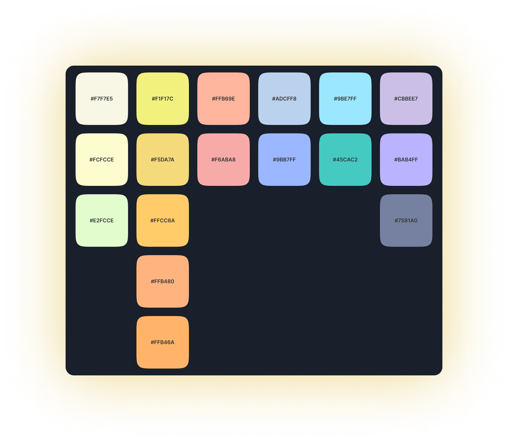

<h1 align="center">
<b>Short Giraffe</b> Theme
</h1>
<p align="center">
Minimalistic, dark and easy-to-eye syntax theme for VSCode, Zed, and your favorite terminals.
</p>


<div align="center">

</div>
<div align="center">
<h3>Short on drama, long on code visibility</h3>
</div>


---

**Built from the ground up,** the Short Giraffe Theme uses a playful yet subtle color palette for a your coding experience.

## Installation for Zed

- Run Zed: Extensions
- Search for Short Giraffe Theme and install
- Done 🎉

## Installation for VSCode

- Open Extensions on the sidebar.
- Search for **Short Giraffe** Theme.
- Install & reload.
- ⌘ + ⇧ + p and type "Color Theme".
- Pick **Short Giraffe** from the list and hit enter.
- Done 🎉

## Terminal Themes

Short Giraffe is also available for popular terminal emulators. Each theme comes in three variants:
- **Short Giraffe** - The original balanced dark theme
- **Short Giraffe Darker** - Even darker background for OLED screens
- **Short Giraffe High Contrast** - Maximum contrast for accessibility

### iTerm2

1. Open iTerm2 → Settings → Profiles → Colors
2. Click "Color Presets..." dropdown → Import...
3. Select a `.itermcolors` file from `src/iterm/`
4. Select the imported preset from the dropdown

### Ghostty

Copy the theme files to your Ghostty themes directory:

```bash
mkdir -p ~/.config/ghostty/themes
cp src/ghostty/* ~/.config/ghostty/themes/
```

Then add to your Ghostty config (`~/.config/ghostty/config`):
```
theme = Short Giraffe
```

### Warp

Copy the theme files to your Warp themes directory:

```bash
mkdir -p ~/.warp/themes
cp src/warp/*.yaml ~/.warp/themes/
```

Then select the theme in Warp: Settings → Appearance → Themes

---

## Color Pallette

A harmonious blend of playful accents and soothing tones that will keep you focused and engaged.



---

🦒  Cheers to the **Short Giraffes** 🦒
