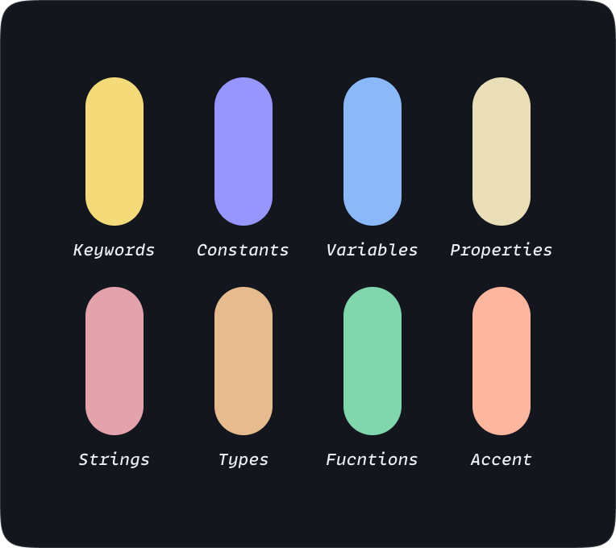

<h1 align="center">
<b>Short Giraffe</b> Theme
</h1>
<p align="center">
Minimalistic, dark and easy-to-eye syntax theme for VSCode, Zed, and your favorite terminals.
</p>


<div align="center">
<picture>
  <source media="(prefers-color-scheme: dark)" srcset="./logo-dark.png">
  <source media="(prefers-color-scheme: light)" srcset="./logo-light.png">
  
</picture>
</div>
<div align="center">
<h3>Short on drama, long on code visibility</h3>
</div>


---

**Built from the ground up,** the Short Giraffe Theme uses a playful yet subtle color palette for a your coding experience.

## Zed

- Run Zed: Extensions
- Search for Short Giraffe Theme and install
- Done 🎉

## VSCode

- Open Extensions on the sidebar.
- Search for **Short Giraffe** Theme.
- Install & reload.
- ⌘ + ⇧ + p and type "Color Theme".
- Pick **Short Giraffe** from the list and hit enter.
- Done 🎉

## iTerm2

1. Download a theme:
   - [Short Giraffe](https://raw.githubusercontent.com/Mehdi-Hp/Short-Giraffe/main/src/iterm/Short%20Giraffe.itermcolors)
   - [Short Giraffe Darker](https://raw.githubusercontent.com/Mehdi-Hp/Short-Giraffe/main/src/iterm/Short%20Giraffe%20Darker.itermcolors)
   - [Short Giraffe High Contrast](https://raw.githubusercontent.com/Mehdi-Hp/Short-Giraffe/main/src/iterm/Short%20Giraffe%20High%20Contrast.itermcolors)
2. Open iTerm2 → Settings → Profiles → Colors
3. Click "Color Presets..." dropdown → Import...
4. Select the downloaded `.itermcolors` file
5. Select the imported preset from the dropdown

## Ghostty

Install the theme directly:

```bash
mkdir -p ~/.config/ghostty/themes && curl -fsSL "https://raw.githubusercontent.com/Mehdi-Hp/Short-Giraffe/main/src/ghostty/Short%20Giraffe" -o ~/.config/ghostty/themes/"Short Giraffe"
```

Or download manually:
- [Short Giraffe](https://raw.githubusercontent.com/Mehdi-Hp/Short-Giraffe/main/src/ghostty/Short%20Giraffe)
- [Short Giraffe Darker](https://raw.githubusercontent.com/Mehdi-Hp/Short-Giraffe/main/src/ghostty/Short%20Giraffe%20Darker)
- [Short Giraffe High Contrast](https://raw.githubusercontent.com/Mehdi-Hp/Short-Giraffe/main/src/ghostty/Short%20Giraffe%20High%20Contrast)

Then add to your Ghostty config (`~/.config/ghostty/config`):
```
theme = Short Giraffe
```

## Warp

Install the theme directly:

```bash
mkdir -p ~/.warp/themes && curl -fsSL "https://raw.githubusercontent.com/Mehdi-Hp/Short-Giraffe/main/src/warp/Short%20Giraffe.yaml" -o ~/.warp/themes/"Short Giraffe.yaml"
```

Or download manually:
- [Short Giraffe](https://raw.githubusercontent.com/Mehdi-Hp/Short-Giraffe/main/src/warp/Short%20Giraffe.yaml)
- [Short Giraffe Darker](https://raw.githubusercontent.com/Mehdi-Hp/Short-Giraffe/main/src/warp/Short%20Giraffe%20Darker.yaml)
- [Short Giraffe High Contrast](https://raw.githubusercontent.com/Mehdi-Hp/Short-Giraffe/main/src/warp/Short%20Giraffe%20High%20Contrast.yaml)

Then select the theme in Warp: Settings → Appearance → Themes

---

## Color Pallette

A harmonious blend of playful accents and soothing tones that will keep you focused and engaged.



---

🦒  Cheers to the **Short Giraffes** 🦒
