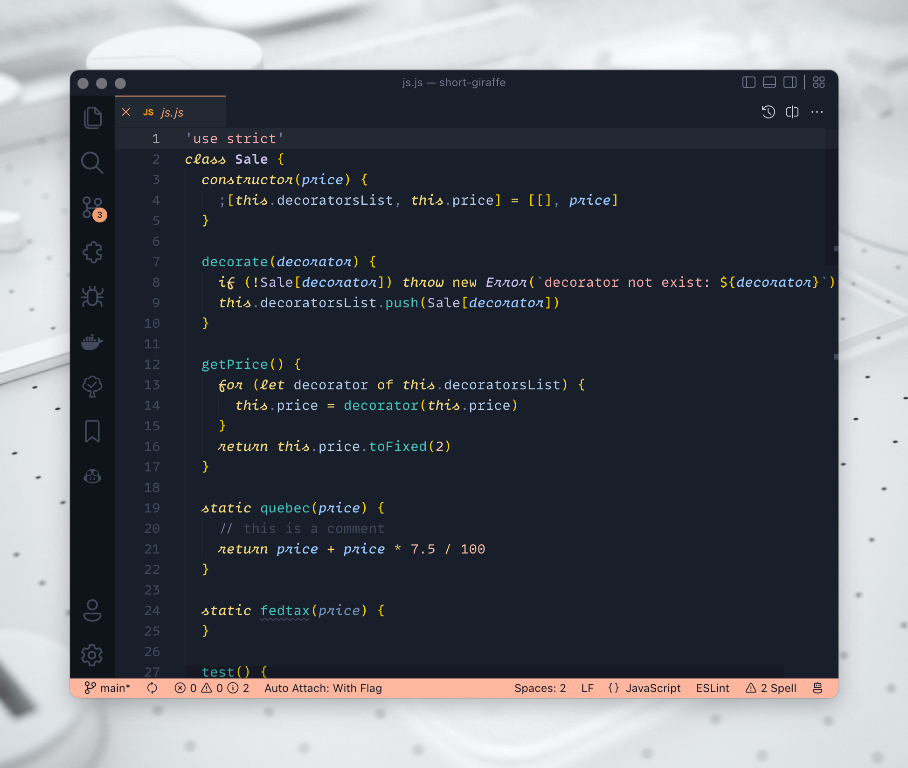
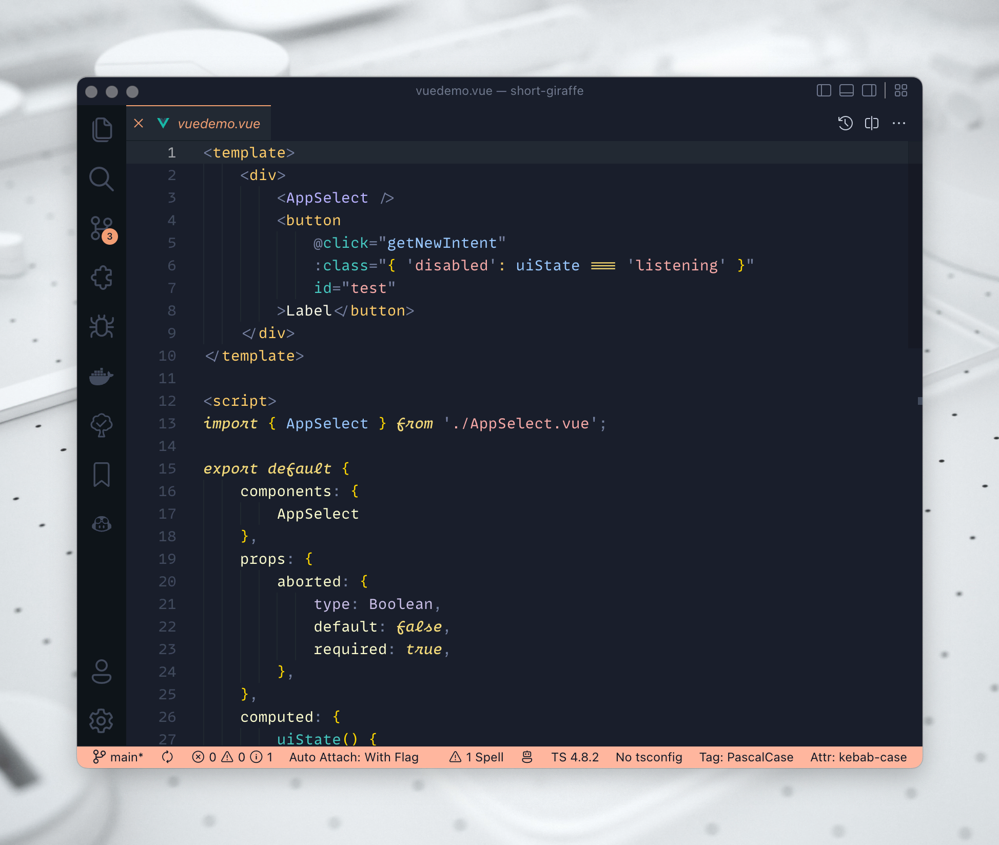
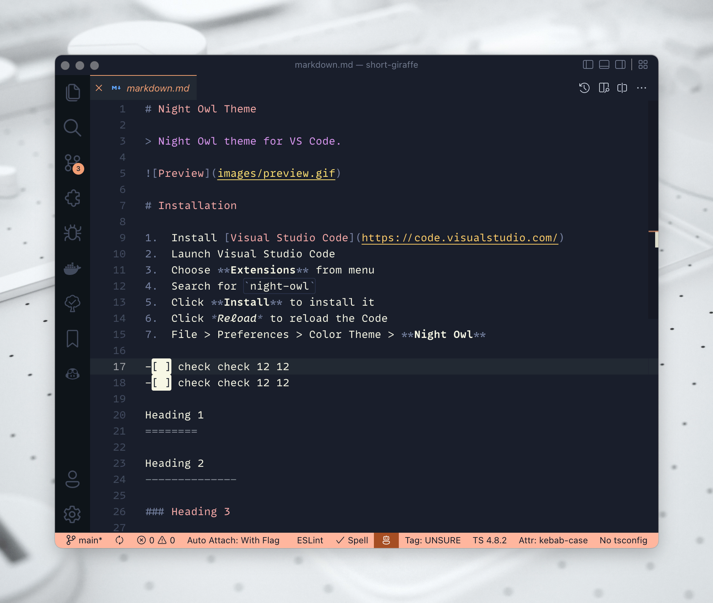

<h1 align="center">
Short Giraffe for VSCode
</h1>

Minimalistic, dark and easy-to-eye theme for VSCode.

---

This is a **from scratch** theme, which has been made with subtle, yet playful colors.

## Instalation
- Open Extensions on the sidebar.
- Search for **Short Giraffe** Theme.
- Install & reload.
- ⌘ + ⇧ + p and type "Color Theme".
- Pick **Short Giraffe** from the list and hit enter.
- Done 🎉

---

## Color Pallette

## Preview

### HTML

### Javascript

### Vue

### JSON

### Markdown

---

🦒  Cheers to the **Short Giraffe** 🦒